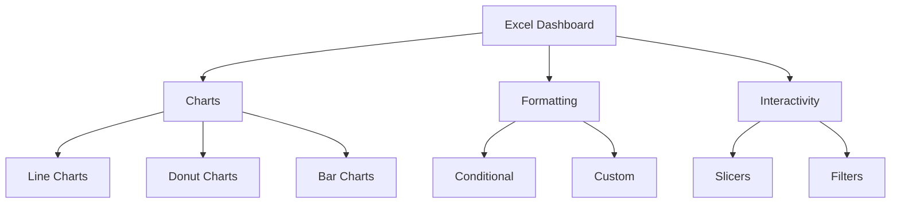

# Blinkit Sales Analytics Dashboard 📊

<div align="center">
  
</div>


## 📌 About The Project
A comprehensive Excel dashboard analyzing Blinkit's last-minute delivery performance metrics, sales trends, and outlet analysis. This project provides actionable insights for business optimization and data-driven decision making.

## 🎯 Key Metrics Analyzed
- **Total Sales:** $1.20M
- **Number of Items:** 8,523
- **Average Sales:** $141
- **Average Rating:** 4.0
- **Performance Analysis:** Outlet Performance by Tiers
- **Product Analysis:** Category Distribution
- **Content Analysis:** Fat Content Distribution

## 🛠️ Tools & Technologies
- Microsoft Excel
- Pivot Tables
- Pivot Charts
- Conditional Formatting
- Data Validation
- VBA (for interactivity)

## 📊 Dashboard Components

<details>
<summary>1. Sales Overview</summary>
<br>
  
- Total and Average Sales metrics
- Historical sales trend (2011-2022)
- Performance indicators
- Growth analysis
</details>

<details>
<summary>2. Outlet Analysis</summary>
<br>
  
- Size distribution (High/Medium/Small)
- Location-based performance
- Tier-wise comparison
- Store type analysis
</details>

<details>
<summary>3. Product Analysis</summary>
<br>
  
- Item type distribution
- Fat content categorization
- Category-wise sales performance
- Inventory insights
</details>

## 🔍 Data Cleaning Process

<details>
<summary>View Data Cleaning Steps</summary>
<br>

### 1. Data Validation
- Removed duplicate entries
- Handled missing values
- Standardized formatting

### 2. Data Transformation
- Created calculated fields
- Standardized categories
- Generated pivot tables

### 3. Quality Checks
- Validated calculations
- Cross-checked totals
- Verified data relationships
</details>

## 📈 Business Insights

### Key Findings
```
📍 Top Performing Categories:
   • Fruits and Vegetables: $178.1K
   • Snack Foods: $175.4K
   • Household Items: $136.0K

📍 Outlet Performance:
   • Tier 3: $472.1K
   • Tier 2: $393.2K
   • Tier 1: $336.4K

📍 Product Mix:
   • Regular Fat: 65%
   • Low Fat: 35%
```

## 💡 Solutions & Recommendations

<details>
<summary>1. Inventory Optimization</summary>
<br>
  
- Implement smart stock management
- Adjust inventory based on outlet performance
- Focus on high-demand categories
</details>

<details>
<summary>2. Outlet Strategy</summary>
<br>
  
- Replicate Tier 3 success practices
- Optimize store sizes
- Implement targeted training
</details>

<details>
<summary>3. Customer Experience</summary>
<br>
  
- Maintain 4.0 rating standards
- Focus on service consistency
- Develop loyalty programs
</details>


## 📊 Visualization Techniques Used


## 🎯 Conclusions

### Impact Areas:
1. **Sales Optimization**
   - Historical growth from $78.1K to $131.5K (2011-2022)
   - Identified peak performance periods
   - Established growth patterns

2. **Outlet Efficiency**
   - Tier 3 locations show highest revenue
   - Medium-sized outlets demonstrate optimal efficiency
   - Location-based performance patterns identified

3. **Product Strategy**
   - Fresh produce category leadership
   - Health-focused category opportunities
   - Balanced inventory distribution needs

## 🤝 Connect With Me
[](https://www.linkedin.com/in/tushar-kshirsagar11/)
[](https://mavenanalytics.io/profile/Tushar-Kshirsagar/201758729)
[](mailto:kshirsagartushar335@gmail.com)


---
<div align="center">
  Created with ❤️ by Tushar Kshirsagar
</div>
